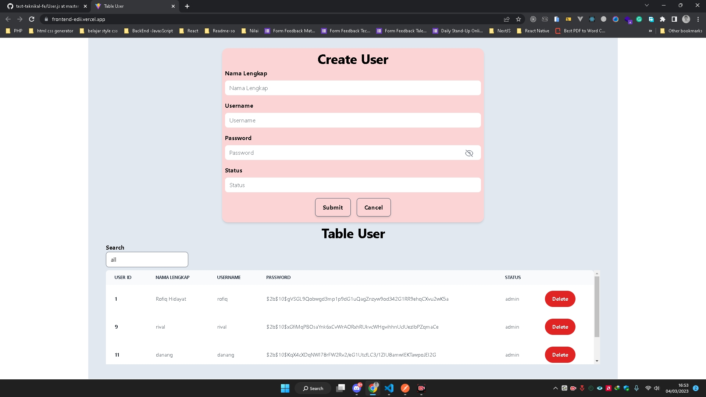

<main>

<h1 align="center"><u>Mockup Test</u></h1>

<h2>Built with</h2>

 

## Table of Contents

-  [Features](#features)
-  [Requirements](#requirements)
-  [Usage](#usage-for-development)
-  [Screenshots](#screenshots)
-  [Related Project](#related-project)

MockUp [`here`](https://frontend-edii.vercel.app/)

## Features

-  Search ID
-  Get Data
-  Delete
-  And others

## Requirements

## Usage for development

1. Open your terminal or command prompt.
2. Type `git clone https://github.com/imbasri/frontend_edii.git`
3. Open folder with your text editor.
4. Start to edit and development.

## Screenshots App

<table border="2">
    

        
          
    

</table>

## Related Project

-  Backend Deploy [`here`](https://backend-edii.vercel.app/)
-  Backend Repo [`here`](https://github.com/imbasri/backend_edii)

<b>&copy;2023 @imbasri☕</b>

</main>
